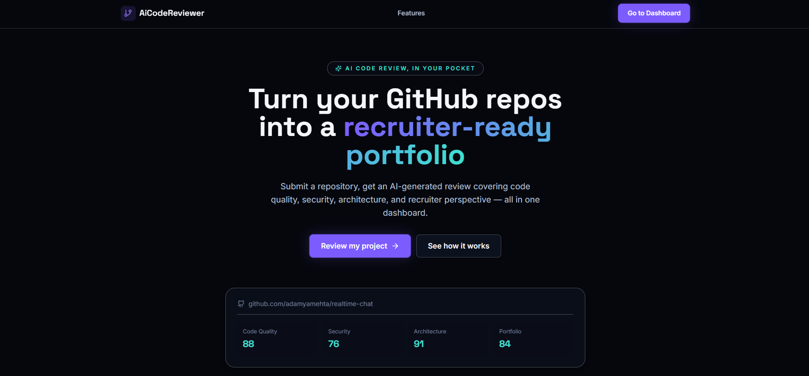
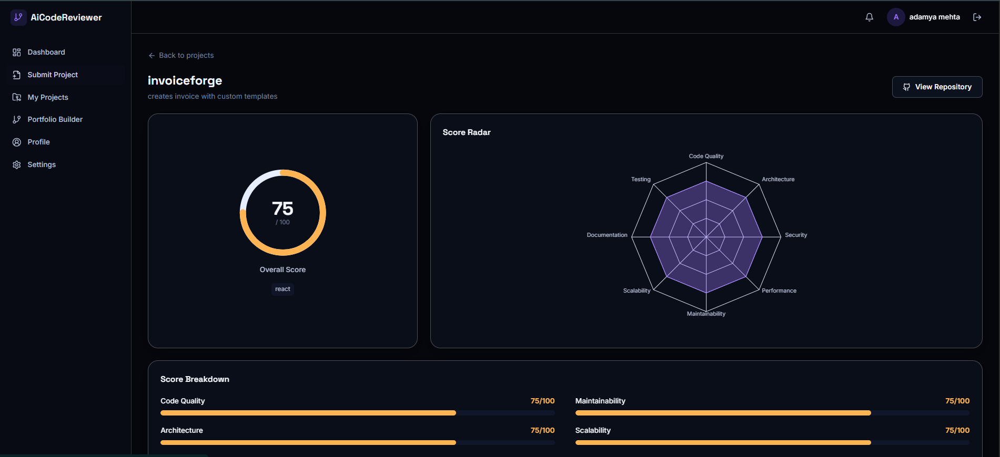
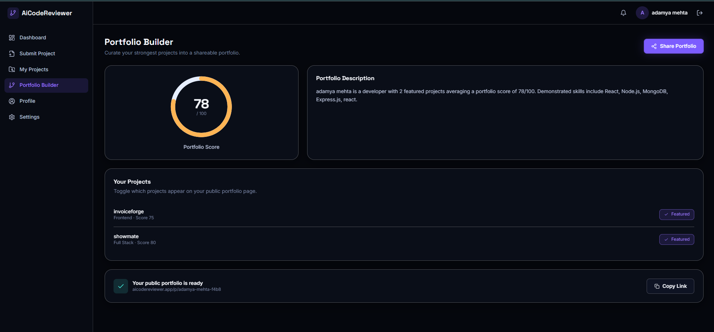

<div align="center">

# 🧠 AiCodeReviewer

### AI-Powered Developer Portfolio & Project Reviewer

Submit a GitHub repository. Get a professional AI-generated code review — quality, security, architecture, performance, and a recruiter-ready report — all in one dashboard.

[](https://aicodereviewer-ten.vercel.app/)
[](https://aicodereviewer-server-q788.onrender.com/api/health)
[](#license)

**[🚀 Live Demo](https://aicodereviewer-ten.vercel.app/)** &nbsp;·&nbsp; **[📡 API Health](https://aicodereviewer-server-q788.onrender.com/api/health)**

</div>

---

## 📸 Screenshots








| Landing Page | AI Review Dashboard |
|:---:|:---:|
| *screenshot here* | *screenshot here* |

| Submit Project | Portfolio Builder |
|:---:|:---:|
| *screenshot here* | *screenshot here* |

---

## ✨ What It Does

A developer pastes a public GitHub repository URL. The platform fetches the actual source code, sends it to an LLM with a structured analysis prompt, and returns a complete code review — scored across nine categories, with concrete strengths, weaknesses, and a recruiter's-eye perspective on the project. The best reviews can then be curated into a single shareable public portfolio page.

```
GitHub URL  →  Repo Analysis  →  AI Review (Groq)  →  Scored Dashboard  →  Public Portfolio
```

---

## 🎯 Core Features

- **One-click repository analysis** — paste a GitHub URL, get a full review in under 30 seconds
- **9-category scoring** — Code Quality, Architecture, Security, Performance, Maintainability, Scalability, Documentation, Testing, Portfolio Readiness
- **AI-generated feedback** — strengths, weaknesses, and actionable recommendations, not generic boilerplate
- **Recruiter Insights** — a dedicated section explaining how a hiring manager would evaluate the project
- **Resume-ready summary** — one-click copy of an AI-written, paste-ready resume bullet point
- **Portfolio Builder** — curate your best-reviewed projects into one public shareable page
- **Fully responsive** — tested from 320px mobile screens to 1440px+ desktops, zero horizontal overflow
- **Real authentication** — JWT-based auth with bcrypt password hashing, not a demo stub

---

## 🛠️ Tech Stack

<table>
<tr>
<td valign="top" width="50%">

**Frontend**
- React 18 + Vite
- Tailwind CSS
- React Router DOM
- TanStack Query (React Query)
- Framer Motion
- Recharts
- React Hook Form + Zod
- Axios

</td>
<td valign="top" width="50%">

**Backend**
- Node.js + Express
- MongoDB Atlas + Mongoose
- JWT Authentication
- Bcrypt
- Helmet, CORS, express-rate-limit
- express-validator
- Groq AI (LLaMA 3.1)
- GitHub REST API

</td>
</tr>
</table>

**Deployment:** Frontend on Vercel · Backend on Render · Database on MongoDB Atlas

---

## 🏗️ Architecture

```
ai-codereviewer-saas/
├── client/                    React + Vite frontend
│   └── src/
│       ├── components/        Reusable UI (Card, ScoreCard, Charts, Layout)
│       ├── pages/              public/ (Landing, Login) + protected/ (Dashboard, Reviews)
│       ├── layouts/             PublicLayout, DashboardLayout
│       ├── hooks/                 React Query hooks (useProjects, usePortfolio)
│       ├── services/               Axios API clients
│       ├── context/                 AuthContext
│       └── utils/                    Zod validation schemas
│
└── server/                    Express + MongoDB backend
    └── src/
        ├── models/             User, Project, Review, Portfolio (Mongoose)
        ├── controllers/        Auth, Project, Review, Portfolio logic
        ├── services/            GitHub fetcher, Groq AI integration
        ├── routes/                REST API endpoints
        ├── middleware/              JWT auth, validation, error handling
        └── prompts/                   Structured AI review prompt
```

---

## 🔄 How a Review Is Generated

1. **User submits** a project title, description, GitHub URL, tech stack, and category
2. **Backend fetches** the repository's file tree via the GitHub REST API
3. **Filters out noise** — `node_modules`, build folders, images, CSS, config files — keeping only meaningful source code
4. **Sends the code** to Groq's LLaMA model with a structured JSON-only prompt
5. **Parses and validates** the AI's response, clamping scores to a 0–100 range
6. **Saves the review** to MongoDB, linked to the project
7. **Renders the dashboard** — animated score ring, radar chart, category breakdown, and AI feedback panels

---

## 🚀 Getting Started Locally

### Prerequisites
- Node.js 18+
- A free [MongoDB Atlas](https://cloud.mongodb.com) cluster
- A free [Groq API key](https://console.groq.com)
- A [GitHub Personal Access Token](https://github.com/settings/tokens) (`public_repo` scope)

### 1. Clone the repository
```bash
git clone https://github.com/<your-username>/ai-codereviewer-saas.git
cd ai-codereviewer-saas
```

### 2. Backend setup
```bash
cd server
npm install
cp .env.example .env
# fill in MONGODB_URI, JWT_SECRET, GITHUB_TOKEN, GROQ_API_KEY
npm run dev
```
Server runs at `http://localhost:5000`

### 3. Frontend setup
```bash
cd client
npm install
cp .env.example .env
npm run dev
```
App runs at `http://localhost:5173`

---

## 📡 API Reference

| Method | Endpoint | Auth | Description |
|--------|----------|:---:|--------------|
| POST | `/api/auth/register` | — | Create a new account |
| POST | `/api/auth/login` | — | Log in and receive a JWT |
| GET | `/api/auth/me` | ✓ | Get current user |
| POST | `/api/projects` | ✓ | Submit a new project |
| GET | `/api/projects` | ✓ | List your projects |
| DELETE | `/api/projects/:id` | ✓ | Delete a project |
| POST | `/api/reviews/:projectId/analyze` | ✓ | Trigger AI review generation |
| GET | `/api/reviews/:projectId` | ✓ | Fetch an existing review |
| GET | `/api/portfolio` | ✓ | Get your portfolio |
| PUT | `/api/portfolio/featured` | ✓ | Update featured projects |
| GET | `/api/portfolio/public/:slug` | — | View a public portfolio page |

---

## 🔐 Security

- Passwords hashed with **bcrypt** (12 salt rounds)
- **JWT** bearer tokens with 7-day expiry
- **Helmet** for secure HTTP headers
- **CORS** restricted to the deployed frontend origin
- **Rate limiting** — 100 req/15min globally, 10 req/15min on auth routes
- Input validation on every endpoint via **express-validator**
- Centralized error handling — no stack traces leaked in production

---

## 🗺️ Roadmap

- [x] Authentication & protected routing
- [x] GitHub repository analysis pipeline
- [x] Groq AI code review integration
- [x] Portfolio builder with public sharing
- [ ] Automated test suite (Vitest + React Testing Library)
- [ ] Code-split bundle for faster initial load
- [ ] Usage-based rate limiting on AI review generation

---

## 📄 License

MIT License — free to use, modify, and learn from.

---

<div align="center">

Built by **Adamya Mehta**

</div>
